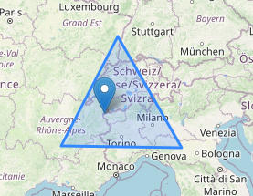

# Mountain Peak

Test technique de création d'une api permettant de réaliser des opérations CRUD sur des pics de montagne, et de faire une recherche de pics contenus dans une zone géographique.

## Installation

1. Installer Docker
2. Cloner le repository : `https://github.com/YamSok/technical-test`
3. Lancer `docker-compose up` dans le dossier cloné

## Utilisation

### Lister les pics

Lister tous les pics en envoyant une requête HTTP GET à `localhost:8000/peak/`.

### Ajouter un pic

Ajouter un pic en envoyant une requête HTTP POST à `localhost:8000/peak/add`. Exemple :

```json
{
    "name": "Mont blanc",
    "lat": 45.8326,
    "lon": 6.8652,
    "altitude": 4807
}
```

### Ajouter plusieurs pics

Ajouter plusieurs pics en envoyant une requête HTTP POST contenant un liste de pic à `localhost:8000/peak/add-many`. Exemple :

```json
[
    {
        "name": "Everest",
        "lat": 27.988056,
        "lon": 86.925278,
        "altitude": 8848
    },
    {
        "name": "K2",
        "lat": 35.8825,
        "lon": 76.513333,
        "altitude": 8611
    },
    {
        "name": "Kangchenjunga",
        "lat": 27.7025,
        "lon": 88.146667,
        "altitude": 8586
    }
]
```

### Récupérer un pic

Récupérer un pic en envoyant une requête HTTP GET à `localhost:8000/peak/<id_du_pic>`.

### Modifier un pic

Modifier un pic en envoyant une requête HTTP PUT à `localhost:8000/peak/<id_du_pic>` au même format que lors de la création.

### Supprimer un pic

Supprimer un pic en envoyant une requête HTTP DELETE à `localhost:8000/peak/<id_du_pic>` :

### Rechercher des pics parmis une zone géographique définie par un polygone :

Envoyer une requête HTTP GET contenant une liste (>2) de coordonnées (lat, lon) formant un polygone. Exemple de requête pour former une zone autour du Mont Blanc:

```json
{
    "points": [
        [44.7598, 4.80821],
        [44.68192, 10.5945],
        [48.38324, 7.50742]
    ]
}
```

Il est possible d'avoir un aperçu de cette zone en particulier via `localhost:8000/peak/map` qui affiche d'un marqueur tous le pics en base, ainsi que la zone définie par la requête d'exemple ci-dessus.


